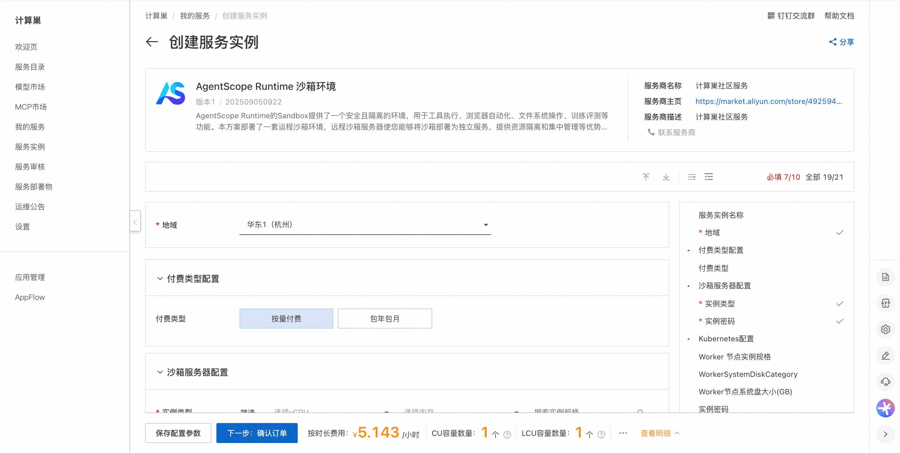
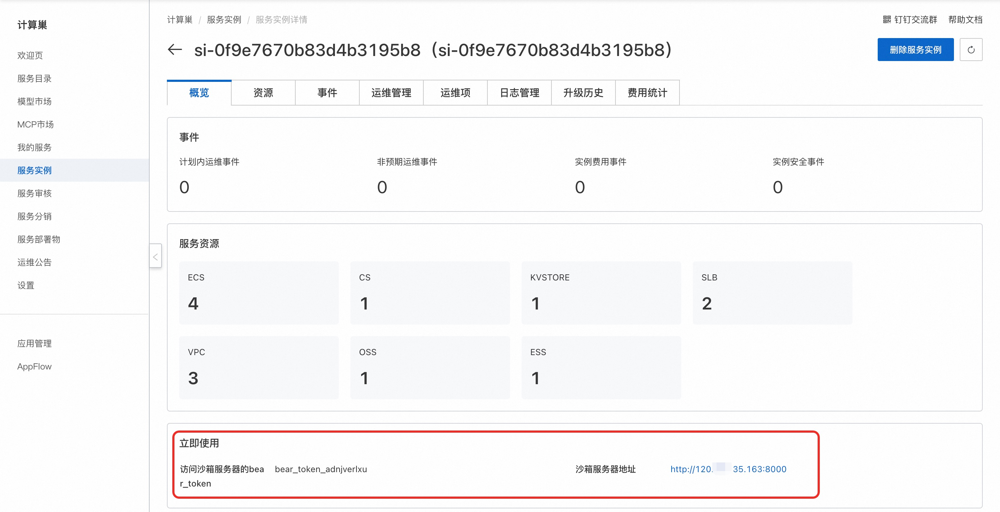
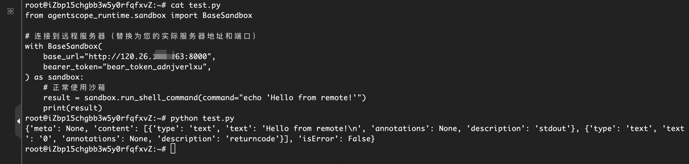
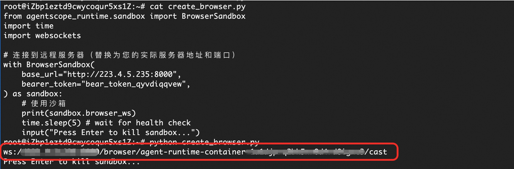

# AgentScope Runtime 沙箱环境快速部署

## 概述

AgentScope Runtime的Sandbox提供了一个安全且隔离的环境，用于工具执行、浏览器自动化、文件系统操作、训练评测等功能。本方案部署了一套运程沙箱环境，远程沙箱服务器使您能够将沙箱部署为独立服务，提供资源隔离和集中管理等优势，您可以通过沙箱SDK连接到远程沙箱服务器。 访问[AgentScope Runtime 官网](https://runtime.agentscope.io/zh/intro.html)查看详情。

## 计费说明

费用主要涉及：

- 所选vCPU与内存规格
- 系统盘类型及容量
- 公网带宽
- 所选的云数据库的规格


## RAM账号所需权限

部署服务时，需要对部分阿里云资源进行访问和创建操作。因此您的账号需要包含如下资源的权限。
**说明**：当您的账号是RAM账号时，才需要添加此权限。

| 权限策略名称                          | 备注                         |
|---------------------------------|----------------------------|
| AliyunECSFullAccess             | 管理云服务器服务（ECS）的权限           |
| AliyunVPCFullAccess             | 管理专有网络（VPC）的权限             |
| AliyunROSFullAccess             | 管理资源编排服务（ROS）的权限           |
| AliyunCSFullAccess              | 管理容器服务（CS）的权限              |
| AliyunROSFullAccess             | 管理资源编排服务（ROS）的权限           |
| AliyunKvstoreFullAccess         | 管理云数据库Tair（兼容 Redis）的权限    |
| AliyunRDSFullAccess             | 管理云数据库服务（RDS）的权限           |
| AliyunComputeNestUserFullAccess | 管理计算巢服务（ComputeNest）的用户侧权限 |

## 部署流程

1. 访问服务[部署链接](https://computenest.console.aliyun.com/service/instance/create/cn-hangzhou?type=user&ServiceId=service-7029e12746fa424db3f3)，按提示填写部署参数：
   

2. 参数填写完成后可以看到对应询价明细，确认参数后点击**下一步：确认订单**。 确认订单完成后同意服务协议并点击**立即创建**进入部署阶段。

3. 等待部署完成后进入服务实例概览页, 可以看到沙箱服务器地址和访问沙箱服务器的bear_token。
   

## 使用示例

### 沙箱类型为Python代码及Shell命令执行
1. 远程连接沙箱服务器（您也可以在本机操作），参考[官方文档](https://runtime.agentscope.io/zh/install.html)安装Agentscope Runtime的稳定版本，创建脚本并运行。
   

   示例脚本如下：
   ```python
   from agentscope_runtime.sandbox import BaseSandbox
   
   # 连接到远程服务器（替换为您的实际沙箱服务器地址和bear_token）
   with BaseSandbox(
       base_url="沙箱服务器地址",
       bearer_token="沙箱服务器bear_token",
   ) as sandbox:
       # 正常使用沙箱
       result = sandbox.run_shell_command(command="echo 'Hello from remote!'")
       print(result)
   ```
 
### 沙箱类型为Web浏览器自动化
1. 远程连接沙箱服务器（您也可以在本机操作）
   
   示例脚本如下：
   ```python
   from agentscope_runtime.sandbox import BrowserSandbox
   import time
   import websockets
   
   # 连接到远程服务器（替换为您的实际沙箱服务器地址和bear_token）
   with BrowserSandbox(
       base_url="沙箱服务器地址",
       bearer_token="沙箱服务器bear_token",
   ) as sandbox:
       # 正常使用沙箱
       print(sandbox.browser_ws)
       time.sleep(5) # wait for health check
       input("Press Enter to kill sandbox...")
   ```
   
2. 创建出沙箱后，会得到一个websocket 连接，通过这个websocket 连接，可以访问browser_use的功能，可以复制得到的websocket 连接，替换到以下示例HTML中547行的baseWsUrl 中，访问此html，就可以访问沙箱的浏览器。
   在地址栏可以访问网址
   


   [示例HTML]()


更多用法请参考[官方示例](https://runtime.agentscope.io/zh/api/index.html)。
